<div align="center">


<br/>


[](https://github.com/FaaStatic)

[](https://www.linkedin.com/in/suhaili-faruq-8475a0189/)
[](https://portfolioweb-55f91.web.app/)

</div>

---

# 👨‍💻 ABOUT_ME.dart

```dart
class Developer {
  final String name = "Suhaili Faruq";

  final String mainRole =
      "Mobile Engineer";

  final List<String> anotherRole = [
  "Web Developer",
  "Backend Developer",
  ]

  final List<String> mainStack = [
    "Flutter",
    "React Native",
    "Android Kotlin",
  ];

  final List<String> backendStack = [
    "Go Fiber",
    "Kotlin KTOR",
    "PostgreSQL",
    "Redis",
    "Clean Architecture",
  ];

  final double experience = 3.5;

  final String location =
      "Jakarta, Indonesia 🇮🇩";

  final List<String> currentlyBuilding = [
    "POS Backend with Go Fiber v3",
    "Scalable React Native Architecture",
  ];

  String mindset() {
    return "Build clean. Build scalable. Keep learning.";
  }
}
````

---

# ⚡ MOBILE DEVELOPMENT

<div align="center">


<br/>


</div>

---

# ⚛️ REACT NATIVE & FRONTEND

<div align="center">


<br/>


</div>

---

# 🤖 NATIVE ANDROID

<div align="center">


<br/>


</div>

---

# ⚙️ BACKEND JOURNEY

<div align="center">


<br/>


</div>

---

# 📊 GITHUB ANALYTICS

<div align="center">

<div align="center">

&nbsp;&nbsp;

</div>
<div align="center">

</div>
</div>

<div align="center">


</div>

---

# 🚀 FEATURED PROJECTS

<div align="center"> 
  <table> 
    <tr> 
      <td align="center"> 
        <a href="https://github.com/FaaStatic/foryou-sinarmasland-source">  </a> </td> <td align="center"> <a href="https://github.com/FaaStatic/myKekancan-app-source">  </a> </td> </tr> <tr> <td align="center"> <a href="https://github.com/FaaStatic/project-survey-app-source">  </a> </td> <td align="center"> <a href="https://github.com/FaaStatic/moneyexpensetracker">  </a> </td> </tr> <tr> <td align="center"> <a href="https://github.com/FaaStatic/nmsmobile-source">  </a> </td> <td align="center"> <a href="https://github.com/FaaStatic/portfolioapps">  </a> </td> </tr> <tr> <td align="center"> <a href="https://github.com/FaaStatic/project_coip">  </a> </td> <td align="center"> <a href="https://github.com/FaaStatic/hebat-apps-source">  </a> </td> </tr> <tr> <td align="center"> <a href="https://github.com/FaaStatic/semargress2022-source">  </a> </td> <td align="center"> <a href="https://github.com/FaaStatic/web-lms-inkaedu-source">  </a> </td> </tr> <tr> <td align="center"> <a href="https://github.com/FaaStatic/naratik-mobile-source">  </a> </td> <td align="center"> <a href="https://github.com/FaaStatic/GithubApp">  </a> </td> </tr> <tr> <td align="center"> <a href="https://github.com/FaaStatic/project-cashier-book-source">  </a> </td> <td align="center"> <a href="https://github.com/FaaStatic/proyek-sistem-desa-source">  </a> </td> </tr> <tr> <td align="center"> <a href="https://github.com/FaaStatic/local_cdn_go">  </a> </td> <td align="center"> <a href="https://github.com/FaaStatic/Shop_project_be">  </a> </td> </tr> <tr> <td align="center" colspan="2"> <a href="https://github.com/FaaStatic/kmp_todo_app">  </a> </td> </tr> </table> </div> 

--- 

# ⚙️ BACKEND JOURNEY 

<div align="center"> 
   <br/>     
</div> 

--- 

# 🧠 CURRENT FOCUS 

```yaml 
Mobile: 
  - Flutter 
  - Flutter Web
  - React Native
  - Native Android Kotlin Frontend
Architecture:
  - Re.Pack + Rspack
  - TanStack Query
  - Zustand
  - Bloc
  - Riverpod
  - Koin
  - Clean Architecture
Backend Journey:
  - Go Fiber
  - KTOR
  - PostgreSQL
  - Redis
  - REST API
```
---

# 📡 CONNECT

<div align="center">

<a href="https://www.linkedin.com/in/suhaili-faruq-8475a0189/">
  
</a>

<a href="mailto:suhaili.faruq01@gmail.com">
  
</a>

<a href="https://portfolioweb-55f91.web.app/">
  
</a>

</div>

<br/>


# 🐍 CONTRIBUTION SNAKE 
<div align="center">  
</div>

